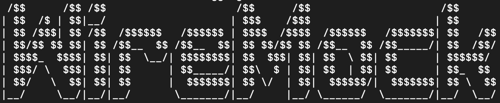
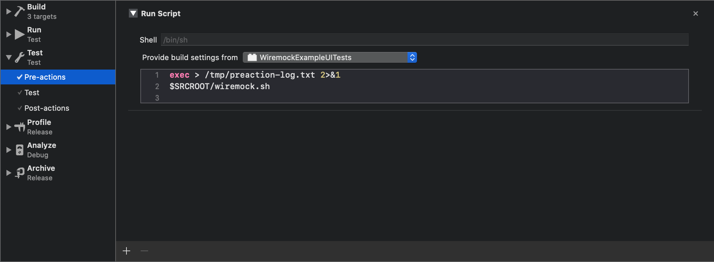
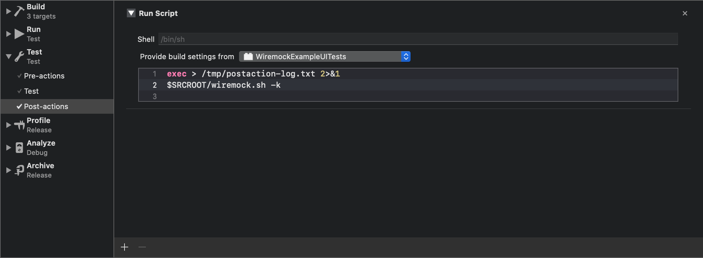

# WiremockExample



iOS project that uses `Wiremock` as a standalone mock server.

## Getting started

To run Wiremock you need Java installed. It is recommended that you use Java 8 or greater.   
The JDK can be downloaded from [oracle's website](https://www.oracle.com/java/technologies/javase/javase-jdk8-downloads.html)

To start the server, run the script `wiremock.sh` located inside `WiremockExample/`

From the project root folder:

```
$ ./WiremockExample/wiremock.sh
```

To shutdown wiremock run the kill command:

```
$ ./WiremockExample/wiremock.sh -k
```

#### Executable

If you are having trouble running `wiremock.sh` as an executable, try changing the file permissions:

```
$ chmod u+x WiremockExample/wiremock.sh
```

## Usage

The project has 3 schemes: 

* DebugWiremockExample
* TestWiremockExample
* WiremockExample

After starting Wiremock, run the Xcode project using `TestWiremockExample` scheme. This scheme uses the `Test` configuration with `localhost:336` as its base Url.

### Mappings and __files

Inside `WiremockExample/Wiremock/mappings` are the json files Wiremock will use to find a match for requests.

Here is what they look like:

```
{
    "request": {
        "method": "GET",
        "urlPathPattern": "/search/repositories",
        "queryParameters": {
            "q": { "matches": "language:swift" },
            "sort": { "matches": "stars" },
            "page": { "matches": "0" }
        }
    },
    "response": {
        "status": 200,
        "bodyFileName": "repositories.json"
    }
}
```

The json specifies the request, and if matched, the response it will have.

The response is also a json file, located at `WiremockExample/Wiremock/__files`

In this example Wiremock must receive `/search/repositories` in the url and those exact query parameters. Otherwise it will keep looking for a match.

If no matches are made, then nothing is returned.

More about stubbing with Wiremock can be found at their [website](http://wiremock.org/docs/stubbing/)

## UI Tests

Wiremock can be used with Xcode to create a self-contained testing environment.

When running tests, the wiremock will be started:



And stopped afterwards:



The command `⌘ + U` run all tests. They must be started using the `TestWiremockExample` scheme.

## Resources

More about Wiremock and testing with Wiremock can be found here:

* [Wiremock documentation](http://wiremock.org/docs/)
* [Self-contained UI tests for iOS applications](https://allegro.tech/2016/10/self-contained-UI-tests-for-ios-applications.html)
* 

## License

This project is licensed under the MIT License - see the [LICENSE](LICENSE) file for details